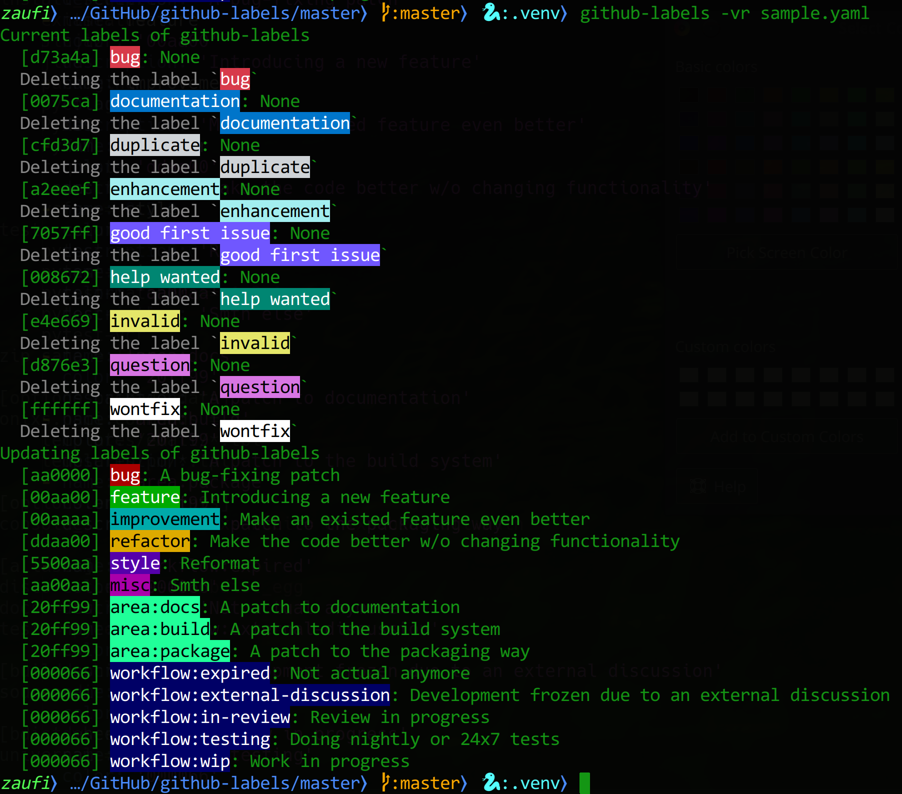

What is this
============

The utility to mass-setting labels to Gihub projects.
This is the prove-of-concept quality code ;-)
I.e., not even *alpha* :)

Usage
-----

.. code-block:: none

    Usage: github-labels [OPTIONS] INPUT_FILE

      Mass-setting of labels at Github repositories

    Options:
      --config TEXT           User config  [default: ~/.config/github-labels.conf]
      -r, --dry-run           Do not perform real actions
      -v, --verbose           Be a little bit verbose
      -s, --only-show-labels  Only show configured labels. Do not do any network
                              operations.
      --help                  Show this message and exit.

The program accepts a YAML file with a list of labels and repocitories to apply.
Basically it looks like this:

.. code-block:: yaml

    repositories:
        - 'owner/repo-1'
        - 'owner/repo-2'
        - ...

    labels:
        - name: bug
          color: 'aa0000'
          description: 'A bug-fixing patch'
        - name: feature
          color: '00aa00'
          description: 'Introducing a new feature'
        - ...

User config contains credentials to access Github:

.. code-block:: yaml

    credentials:
        user: '<your-user>'
        password: '<your-pass>'

Screenshots
-----------

Caveats
-------

* It **always** use ANSI colors for TrueTerminals, so if your terminal is not TrueColor... OOPS
* Error handling need some care... You can see a Python backtrace sometimes %)

TODOs
-----

* Tests?
